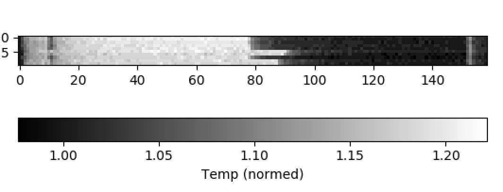

Let's start into the cluster:

```python
ssh -X ricardo@kneipe.lavis.unam.mx
#
qlogin
module load python/3.6.5 anaconda3/4.2.0 
source activate env_cesar
ipython
```

and copy input files from:

```python
cp -r /media/public/python_viz/ .

```

And start `ipython3`

iPython contains a lot of convenient functions called magic functions

```python
# to see help
%matplotlib?

# Prepare ipython for interactive mode
%matplotlib qt

# iPython contains a lot of convenient functions called magic functions
%magic
```

**Magic functions only works in ipython and Jupyter notebooks**. This means that the previous code will raise an error if executed in python interpreter or in a script.

```python
import numpy as np
import matplotlib.pyplot as plt
```

## Basic plots

You can create a numpy array from an existing data type like a list

```python
mylist = [1, 2, 3, 4, 5]
x = np.array(mylist)
```

 Lets decipher the `type` of the object `x` and `mylist`

| type(mylist) | type(x)       |
| ------------ | ------------- |
| list         | numpy.ndarray |

And array could be a from a severa vector of length _v_ 

Also, the functions included in numpy module returns a numpy array.

```python
y = np.linspace(1, 5, 5)
```

> You can look the help of the command by `?np.linspace` 
>
> np.linscape(arg0 arg1, arg2) arguments mean: arg0  = the start value, arg1= the end value and arg2 = the size of the intervals bewteen this min / max value.

You can plot these data easily using matplotlib (plt)

```python
plt.plot(x, y)
```

In a script context, matplotlib does not display the plot by defaultt. If you want to display the plot you need to use the show function as follows : `plt.show()`

Finally ... to store the plot :

```python
plt.savefig('plot1.png', dpi=100)
```

and close

```python
# Close figure - This is necessary to avoid undesired mixed plots
# or to avoid RAM memory saturation.
plt.close()
```

To save history, let's type:

```pythin
 %history -f myPyhistory.txt
```

## MORE PLOTS - OPERATIONS WITH NUMPY - ARRAYS #

A numpy array is a Python object and is implemented to easily apply many operations to it.

```python
x = np.linspace(0, 50, 100)
z = x[::-1] # the array is inverted / sliced
y = x ** 2 # each number is rise to the square
y2 = x / x.max() # divide each element in x to the sum(x) <normalizing method>
y3 = 2 ** x # the constant number 2 rise to x
```

Lets to do plot

```python

plt.plot(x, z)
# plt.show()
# plt.close()

plt.plot(x, y)  # power function
# plt.show()
# plt.close()

plt.plot(x, y2)  # normalization or scaling

plt.plot(x, y3)  # exponential function

# Really straightforward ... what happen if...
plt.plot(x, x * z)

```

 Now lets make a more complete plot

 ```python
plt.plot(x, y, '--b', label='$y = x^2$')
plt.xlabel('x')
plt.ylabel('y')
leg = plt.legend()

 ```


Editing plots:

```python
plt.title("this is my first title")
plt.tight_layout()
leg.draggable()
#plt.savefig('first_plot.png', dpi=200)

```

### Numpy random sub package and more marplot figures

numpy includes some subpackages like random data generation. `np.random`.  Create some random normal distributed data (ie. mean = 0 and Std = 1):

```python
n_random = np.random.randn(1000)
```

And plot an histogram:

```python
# Plot as a histogram
plt.hist(n_random)
# To few bars? you can change the bins parameters using a
# list of values or a scalar.
plt.hist(n_random, bins=25)
plt.show()
```


 And plot as an boxplot:

```python
plt.boxplot(n_random)
```

 You can create also another types of random data, for example: uniform distributed data or gumbel distributed data

```python
u_random = np.random.uniform(size=1000)
g_random = np.random.gumbel(size=1000)
```

...

```python
plt.boxplot([n_random, u_random, g_random])
```

it seems that the plot lacks the name corresponding of each boxplot. We can assign it using plt.xticks function

```python
plt.boxplot([n_random, u_random, g_random])
plt.xticks([1, 2, 3], ['Normal', 'Uniform', 'Gumbel'])
plt.xlabel('Distribution')
plt.show()
```


> WARNING: boxplot is not good to present a uniform distribution. It Looks nice, still, it might be confusing, particularly in the uniform distribution. Maybe in this case the boxplot is not properly used. So we may add all the histogram in one figure.

### Begin to advanced

Put all plots together using `plt.subplot`

Let's create a wrapped - grid figure

```python
# Let's create a compound figure
# histograms
plt.figure()
```

Then, we start making a grid from dimension 7*7  and start to arrange the position of each of the plot in the grid by describing its coordinates:

> Numero de filas, numero de columnas, posicion donde se imprime el plot 

```python
# Figure
plt.figure(figsize=(7, 7))
# boxplot
plt.subplot(211)
plt.boxplot([n_random, u_random, g_random])
plt.xticks([1, 2, 3], ['Normal', 'Uniform', 'Gumbel'],
           fontsize='large')
plt.title('Distributions')

```

Normal

```python
plt.subplot(131)
plt.hist(n_random, bins=25)
plt.title('Normal distributed')
```

Uniform

```python
plt.subplot(132)
plt.hist(u_random, bins=25)
plt.title('Uniform distributed')
```

And Gumel

```python
plt.subplot(133)
plt.hist(g_random, bins=25)
plt.title('Gumbel distributed')
```


> \## --END Advanced -- ##
>
>  

# Section II

> Exploring_np_plt-2.py

Prepare ipython for interactive mode

```python
%matplotlib qt

# first import the modules
import numpy as np
import matplotlib.pyplot as plt
#MORE PLOTTING AND A LITTLE OF #
#    SCIPY STATS

from scipy import stats

```

And, lets create some good data :)

```python
x = np.arange(26)

pcor = stats.pearsonr(x, x)
print('r = ', pcor[0])
print('p-value = ', pcor[1])
```

And input some noice in the data

```python
# now, some noise to the data
r_factor = np.random.normal(loc = 0, scale
    ...:  = 5, size = len(x))

r_factor.mean()
r_factor.std()
# and easly plot it
plt.hist(r_factor)
```

Then, lets continue.

```python
y = x + r_factor
plt.plot(x,y)
```

And without close the object (`plt.close()`). lets scatter this plot:

```python
plt.scatter(x,y)
```


Suppose this is a real date with trends in him. let's figure out its Pearson correlation by:

```python
pcor = stats.pearsonr(x, y)
```

Resultin in a high correlation and low pvalue from this correlation: `Out[21]: (0.92027503328000237, 2.8834653427513064e-11)`.

Lets also fit the least squares of linear correlation from the equation `y =mx + b`

```python
fit = np.polyfit(x, y, 1)
m, b = fit[0], fit[1]
```

> Good!

Ltes make a function than apply the squares equation to a vector `x`

```python
def lin_func(x):
    return m*x + b
```

Then,

```python
lin_func(x)
```

...

```python
# To plot the fitted line we need to create the corrsponding
# x,y points
x2 = np.linspace(0, 25, 1000)   # a lot of points (1000)
y2 = lin_func(x2) 
```

And then , plot

```python
plt.close()
plt.scatter(x, y, color='g', s=20, label='Data')
plt.plot(x2, y2, color='r', label='Linear fit')
plt.xlabel('x')
plt.ylabel('y')
plt.legend()
```


And let's annotate this plot by using `Latex` formula:

```python
annotation = 'Linear fit : $y = {:.2}x + {:.2}$\n $r = {:.2}$\n $p = {:.2}$'
annotation = annotation.format( m, b, pcor[0], pcor[1])
ann = plt.annotate(annotation, xy=(0, 18), fontsize='small')
```

You can use `ann.draggable()` in order to adjust the labels in the plot

The annotation format works as an replacement in each `{}`:

```python
mystr = '{} bioinformatic guys, nice to met {}'
mystr.format("Hello", "You")
# Out[47]: 'Hello bioinformatic guys, nice to met You
'
```


Finally, save the figure as:

```python
plt.savefig("scatterpot.png"m dpi=100)
```


## What about a t-test?

Lets create 2 independent samples from random normal distributions. First visualize the distributions that we are going to sample. Means 18 and 22 (~20% of difference between means). Same standard deviation = 2.

```python
plt.subplot(211)
plt.hist(np.random.normal(18, 2, size=10000), bins=20)
plt.title('Distribution 1')
plt.xlim((10, 30))
#
plt.subplot(212)
plt.hist(np.random.normal(22, 2, size=10000), bins=20)
plt.title('Distribution 2')
plt.xlim((10, 30))
```


The t-test want to figureout the statistical difference between this two populations. 

Now, lets sampling the data 

```python
n1 = 10
n2 = 10

sample1 = np.random.normal(18, 2, size=n1)
sample2 = np.random.normal(22, 2, size=n2)

```

And figure out the mean, sd, and se

```python
# Mean value
mean1 = sample1.mean()
mean2 = sample2.mean()

# Standard deviation
std1 = sample1.std()
std2 = sample2.std()

# Standard error of the mean
sem1 = std1 / np.sqrt(n1)
sem2 = std2 / np.sqrt(n2)
```

And finally plot :)

First the boxplot by labeling the x ticks and y label

```python
plt.subplot(311)
plt.boxplot([sample1, sample2])
plt.title('Boxplot')
plt.ylabel('Arbitrary units')
plt.xticks([1, 2], ['Sample 1', 'Sample 2'])

```

Then, the sd of the mean its error bars

```python

# point plot with standard deviation of the mean
plt.subplot(312)
plt.errorbar([1, 2], [mean1, mean2], yerr=[
             std1, std2], label='Mean +- std', fmt='o')
plt.title('Point plot (std)')
plt.ylabel('Arbitrary units')
plt.xticks([1, 2], ['Sample 1', 'Sample 2'])
plt.xlim((0.5, 2.5))
```

And finally, the 

```python
plt.subplot(313)
plt.bar([1, 2], [mean1, mean2], 
        yerr=[sem1, sem2],
        label='Mean +- s.e.m', width=0.4)
```

And add adjust limits, layout and labels as follow:

```python
plt.ylabel('Arbitrary units')
plt.xticks([1, 2], ['Sample 1', 'Sample 2'])
plt.xlim((0, 3))
plt.ylim((15, 24))
# layout
plt.tight_layout()
```


Good!

> Question: Are there statistically significant differences between the means?
>
>  

Depend of the what type of error bar are you showing. We can use de Standar deviation (std), the Standar error mean (s.e.m) or confidence intervals (CI). read [this report](https://www.ncbi.nlm.nih.gov/pmc/articles/PMC2064100/) for details.

## Hypotesis testing

> Are the data normally distributed?

Assumptions is: Data is normally distributed

Let's to use the `shapiro` test.

> This time we' ll add the documentation by adding ``"""`` before and after the documentation.

```python
def is_normal(x, pvalue=0.05):
    """Returns True if the data is normally
       distributed with a given p-value threshold

    - x : numpy 1d array or list of integers|floats
    - pvalue : threshold to reject null hypothesis
    """
    s, pv = stats.shapiro(x)
    if pv > pvalue:
        return True
    else:
        return False
```

And then, run

```python
?is_normal
print('sample1', is_normal(sample1))
print('sample2', is_normal(sample2))
#True
#True

```

if both samples are normally distributed you can use student's t

```python
ttest = stats.ttest_ind(sample1, sample2)
print('T test p-value:', ttest.pvalue)
    ...:
    ...:
# T test p-value: 1.49653905006e-06
```

### Exercise

What would happen to the samples parameters (std, s.e.m.) if you change the sample size to. Is there a statistically significant difference between the sample means? # If not, how can you simulate samples that are statistically different?   

```python
# Try different sample sizes
# maintaining the same mean and stds!!!!
samples = {3: 0,
           10: 0,
           20: 0}

```

Then,

```python
# making 1000 simulations
for i in range(1000):
    # testing each sample sizes
    for j in [3, 10, 20]:
        # samples
        s1 = np.random.normal(18, 2, size=j)
        s2 = np.random.normal(22, 2, size=j)
        # testing
        ttest = stats.ttest_ind(s1, s2)
        # Reject Ho?
        if ttest.pvalue <= 0.05:
            samples[j] += 1

samples
```

# Section III - distribution noise in your data

### `shape` and `flatten` in `numpy`

```python
# Prepare ipython for interactive mode
%matplotlib qt

# first import the modules
import numpy as np
import matplotlib.pyplot as plt
```

then, Use `shape` in order to know the rows and columns from a object (matrix in this case)

```python
# How about some noise in 2d?
noise = np.random.rand(100, 100)
# shape of the array
noise.shape
# Out[3]: (100, 100)
```

And visualize the figure as:

```python
# You can visualize a matrix (2d) with the following functions
plt.matshow(noise)
plt.colorbar() # add color bar
# or with imshow
plt.imshow(noise)
```


And lets 'flat' the matrix `noise` in order to do an histogram. 

> What distribution is it?

```python
plt.hist(noise.flatten())
```


...

Let's make a function than pipe the data `noise`

```python
def show_matrix(matrix):
    plt.figure()
    plt.subplot(121)
    plt.imshow(matrix)
    plt.colorbar()
    plt.subplot(122)
    plt.hist(matrix.flatten())
```

And lets try with normal distributed data

```python
# Now, normal distributed noise
n_noise = np.random.randn(100, 100)
show_matrix(n_noise)
```


> The shape of the distribution are normally distribution. ie. Almost the halft of values are equal to 0. 

Let's now try a **left-distributed** data example

First mask the noise object as follow:

```python
# You can create a mask for the 2d array. For example,
# we are going to replace every value < 0 to 0
mask = n_noise < 0
# Check mask shape
mask.shape == n_noise.shape
# Visualizing the mask
plt.imshow(mask)

# replace values
n_noise[mask] = 0
show_matrix(n_noise)
```

plot then,


## Loadding real data

```python
data = np.loadtxt('data/data1.txt', dtype=np.int)
```

And lets figure out the shape (structure) from this object

```python
data.shape
# Out[24]: (1371, 1833)
```

And lest plot with the function `show_matrix`

```python
show_matrix(data)
# and re-color it
plt.imshow(data, cmap='gray', vmin=0, vmax=255)

```

Surprise!!


You also can select a part of the matrix in order to plot

```python
fragment = data[100:850, 750:1600]
plt.imshow(fragment, cmap='gray', vmin=0, vmax=255)

```


The picture is a little dark, we can create new pictures with more brightness by increase the luminosity of the pixels by increase the data elements.

```python

pic1 = data * 2
pic2 = data + 100 # increase the luminosity of the pixels

plt.subplot(121)
plt.imshow(pic1, cmap='gray', vmin=0, vmax=255)
plt.subplot(122)
plt.imshow(pic2, cmap='gray', vmin=0, vmax=255)

```


What about a nice figure with the results and including the histograms?.

Creates an object of figure attributes

```python
fig = plt.figure()
```

From the original color-gradient:

```python
plt.subplot(231)
plt.imshow(data, cmap ="gray", vmin = 0, vmax = 255)
plt.axis("off")
```

Let's start coordinates the grid with different color (brightness) parameters:

```python
plt.subplot(234)
plt.hist(data.flatten())
plt.xlim(0, 255)
```

Also, multiplied:

```python
plt.subplot(232)
plt.imshow(pic1, cmap="gray", vmin = 0, vmax =255)
plt.axis('off')
# histogram
plt.subplot(235)
plt.hist(pic1.flatten())
plt.xlim((0, 255))
```

Finally, plot the +100 brightness

```python
plt.subplot(233)
plt.imshow(pic2, cmap='gray', vmin=0, vmax=255)
plt.axis('off')
# histogram
plt.subplot(236)
plt.hist(pic2.flatten())
plt.xlim((0, 255))
```

And then

```python
plt.tight_layout()
```


> Perfect!!!

# Pandas

load modules

```python
# Prepare ipython for interactive mode
%matplotlib qt

# first import the modules
import numpy as np
import matplotlib.pyplot as plt
import pandas as pd
```

Then, load the data frame

```python
data = pd.read_table('data/data2.txt', index_col=0, parse_dates=True)
```

> `data.shape`
> Out[46]: (159, 10)
>
> Index_col argument means the row names as in R

The DataFrame is a data structure with labeled columns and rows(index) to easily access the data.

```python
data.columns
data.index
```

> both, `columns`and `index` is the parallel of *colnames* and *rownames* in R

Let's select only column 1

```python
data['craspi01']
print(type(data['craspi01']))
# <class 'pandas.core.series.Series'>
```

Let's plot in order to visualize a pattern on this data

```python
data.plot()
```


Amazing !!!!

As we see, for *panda* first stablish `Object`.`function()` in order to work:

```pyhton
data.plot.box()
data.plot(subplots=True)
```

 ... and to describe a summary statistics from this data:

> this processedure plot the follow stats
>
> data.describe().index
> Index(['**count**', '**mean**', '**std**', '**min**', '25%', '50%', '75%', '**max**'], dtype='object')

```python
c_stats = data.describe()
# some operations returns a new dataframe

```

Let's also make te stats by rows. First, transpose the the element `mean` from the object s_stats to stast the rows

```python
c_stats.T['mean']
```

Also, apply to all the rows (elements) fro the dataframe 

```python
r_stats = data.T.describe()
```

`loc` and `iloc` are usefull to select rows by `column` name and `index`name

```python
c_stats.loc['mean']
c_stats.iloc[1]
```

We can use the series with other functions

```python
means = r_stats.loc['mean']
stds = r_stats.loc['std']
xs = range(len(means))

```

And visualize

```python
plt.errorbar(xs, means, yerr=stds, fmt='ob--', alpha=0.5)

# ... or maybe prettier
plt.plot(xs, means)
plt.fill_between(xs, means - stds, means + stds, alpha=0.3)
# r_stats.T.plot(y='mean', yerr='std', fmt='bx--', alpha=0.5)
# r_stats.T.plot(y=['mean', 'max'], yerr='std', fmt='bo--', alpha=0.5)

```

Good!

lets improve more slides

```python
# We can visualize data in many ways
plt.imshow(data.T, cmap='gray')
plt.colorbar(label='Temperature', orientation='horizontal')

# We can obtain smart slices
data.loc['2017-01-06 12:50':'2017-01-06 13:50']
data.loc['2017-01-06 12:50':'2017-01-06 13:50'].plot()

```


And finally, normalizing data

```python
# Finally, what about data normalization?
# Now, we will plot the data relative to the initial value
data.iloc[0]

n_data = data / data.iloc[0]
n_data.plot()
```

And then. lets replicate a type of raster plot [example](https://www.google.com.mx/search?q=raster+plot&rlz=1C5CHFA_enMX801MX802&source=lnms&tbm=isch&sa=X&ved=0ahUKEwjK47fE6uDbAhUDYKwKHevDDjkQ_AUICigB&biw=1280&bih=659) here

```python
plt.imshow(n_data.T, cmap='gray')
plt.colorbar(label='Temp (normed)', orientation='horizontal')

```



# Real biological data

load KEGG data.

KEGG is a public and specialized database for metabolic data.

```python
kegg = pd.read_table('data/data3.txt', index_col=0)
```

Good, lets summary and structure this object

```python
# Each column (or data Series) may have a different data type
kegg.dtypes # attribute because it doesnt have ()
kegg.head()
kegg.tail()
```

Ok. now, how many missing data do we have?

lets first to create a mask of boolean (true/false) values

```python
miss = kegg.isnull()
```

... then, sum the values. Remember that: 

- True == 1
- False == 0

```python
miss.sum()
Out[61]:
tax1             0
tax2             0
tax3             0
spname           0
nucleotides    335
orfs             1
enzymes         46
rnas           147
dtype: int64
```

What organisms has these null values in nucleotide column?

```python
mask = kegg['nucleotides'].isnull()
nuc_null = kegg[mask]['tax1']

```

Then, lets count (as `table` in R) :

```python
nuc_null.value_counts()
#Out[65]:
# Eukaryotes     331
# Prokaryotes      4
# Name: tax1, dtype: int64
```

And meassure the percentage of kingdoms

```python
nuc_null.value_counts() / kegg['tax1'].value_counts() * 100
```

| Eukaryotes  | 89.701897 |
| ----------- | --------- |
| Prokaryotes | 0.089326  |

Although we have a lot of missing data, we can still work with it.

Now, explore the taxa included in the data. First, how many prokaryotes and eukaryotes?

```python
tax1 = kegg['tax1'].value_counts()
tax1.plot.pie(autopct='%.1f')
```

Second, what eukaryotes taxa do we have? and how many organism by taxon?

```python
euk_mask = kegg['tax1'] == 'Eukaryotes'
euk = kegg[euk_mask]

euk_taxa = euk['tax2'].value_counts()
euk_taxa.plot.pie(autopct='%.1f')
```

... and prokaryotes?

```python
prok_mask = kegg['tax1'] == 'Prokaryotes'
prok = kegg[prok_mask]

prok_taxa = prok['tax2'].value_counts()
prok_taxa.plot.pie(autopct='%.1f')

```

## Final words

Let's think... What would be the relation between the genome size in nucleotides and the number of ORFs?

```python
kegg.plot.scatter(x='nucleotides', y='orfs')
```

 Good!, and also we can color-label by the representative domain

```python
euk.plot.scatter(x='nucleotides', y='orfs')
prok.plot.scatter(x='nucleotides', y='orfs')
```

....

We already have an Eukaryotes mas. remember that we modified the original kegg DataFrame

```python
euk = kegg[euk_mask]
```

Prokaryotes are in reality two natural groups. Bacteria and Archaea

```python
bmask = kegg['tax2'] == 'Bacteria'
amask = kegg['tax2'] == 'Archaea'
bact = kegg[bmask]
arch = kegg[amask]
```


 

We will create a custom plot with matplotlib

 

```python
plt.figure()
plt.scatter(bact['orfs'], bact['proportion'],
            alpha=0.3, label='Bacteria', s=20)
plt.scatter(arch['orfs'], arch['proportion'],
            alpha=0.3, label='Archaea', s=20)
plt.scatter(euk['orfs'], euk['proportion'],
            alpha=0.3, label='Eukarya', s=20)
leg = plt.legend()
plt.xlabel('ORFs', fontweight='bold')
plt.ylabel('Enzyme proportion', fontweight='bold')

```


Then,

```python
plt.savefig('ecVSorf.png', dpi=300)
```


 
